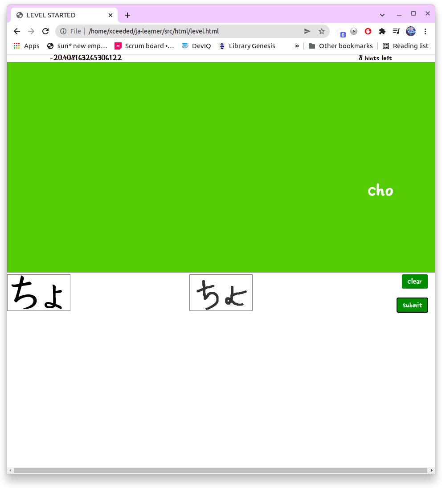

# JA Learner
- Static page app to help learning japanese alphabet
- Has a game where
    - User draw the japanese letter for each of its romanji version on the screen.
    - Simple matching and scoring system to motivate learner ^^.
    - Has hints
    - Easily customizable with config file placed at assets/config.js
    - Only hiragana and katakana for now.
# Demo images
- Home page: 
- Game level: 
